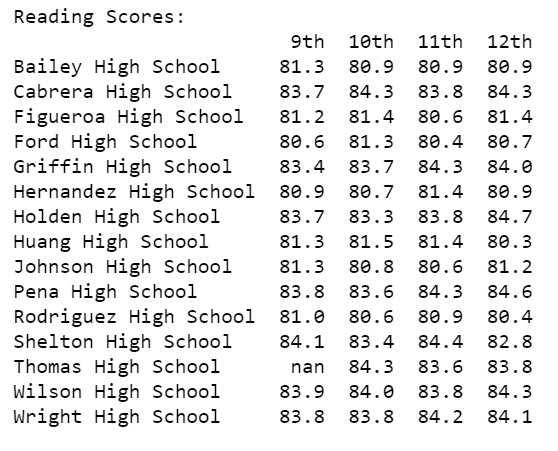
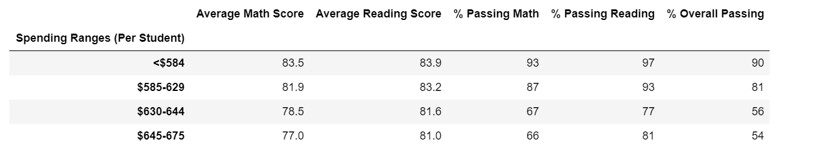

# School_District_Analysis
This is for bootcamp module 4 for school district standardize tests analysis

# Module 4 Challenge
### Background
The grades of the ninth graders at Thomas High School have been changed. While administrators do not know the full extent of this academic dishonesty, they want to uphold the standards of state testing and have turned to you for help.

After assessing the situation with the school superintendent and Maria, you decide the best approach is to:

Replace the ninth-grade math and reading scores from Thomas High School.
Keep all other data associated with the ninth-grade students and Thomas High School intact.

### Objectives
The goals of this challenge are for you to:

* Filter DataFrames using logical operators.
* Replace the incorrect values with NaN.
* Explain how your PyCitySchools analysis changes after you handle the incorrect data.  

### Clean student names without prefix and suffix

### Replace the reading and math scores for ninth graders at Thomas High School with NaN, using nuppy.nan and loc() by pandas
All 9th grade students math and reding scores for Thomas High changed to Nan

### Merge the clean student data with the school dataset.

### District summary and School Summary
Due to no Math and Reading score for 9th grader for Thomas High districts Average math score, Avarage resing score, %Passing math, % Passing reading,  % Overall passing is gone down.

After Nan District Summary image

Original District Summary image

### Top 5 High performing schools 
Before replacing the ninth graders’ math and reading scores Thomas High School was one of the top 5 performing school. After replacing the ninth graders’ math and reading scores Thomas High School is not in top 5 performing schools

Top 5 performing schoold after replacing the ninth graders’ math and reading scores.

Top 5 performing schoold before replacing the ninth graders’ math and reading scores.

### Bottom 5 Low performing schools

Bottom 5 performing schoold after replacing the ninth graders’ math and reading scores.

Bottom 5 performing schoold before replacing the ninth graders’ math and reading scores.

### Math and Reading Scores by Grade
Images shows that Math score for 9th grade Thomas High is Nan

Images shows that Resding score for 9th grade Thomas High is Nan

### Scores by School Spending
After replacing the 9th grade math and reading scores Math Passing, Reading Passing and Overall Passing % went down

Before replacing Math and Reading scores

### Scores by School Size
After replacing 9th grade Math and Reading scores for Thomas High, middle size schools Passing MAth, Passing Reading and Overall Passing percent went down

Before replacing Math and Reading scores

### Scores by School Type
After replacing 9th grade Math and Reading scores for Thomas High, charter schools Passing Math, Passing Reading and Overall Passing percent went down

Before replacing Math and Reading scores

